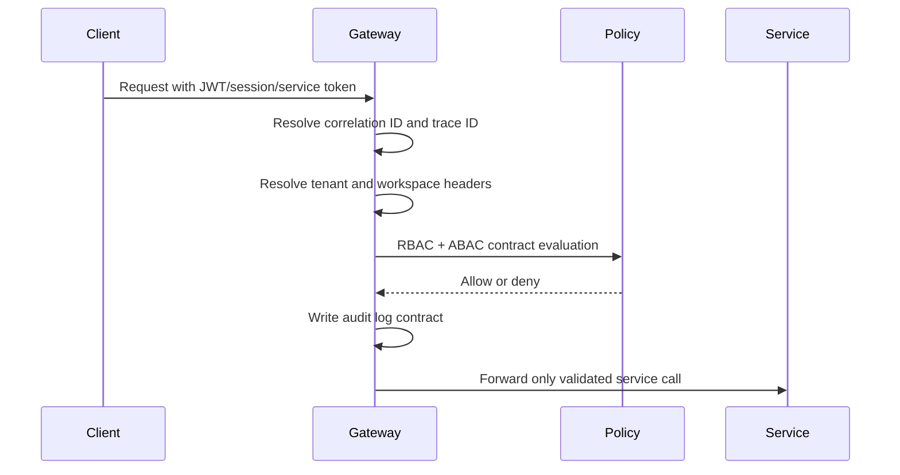

# Auth Flow Map

## Hybrid Auth Boundary

Accepted foundation mechanisms:

- JWT bearer token
- platform session cookie
- service token

Raw Odoo sessions are not accepted as platform auth.

## Authorization Boundary

RBAC contracts define coarse roles. ABAC constraints bind access to tenant and workspace context.
