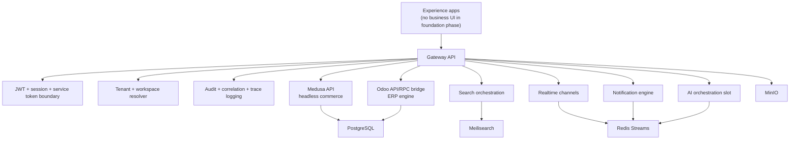

# Runtime Architecture Map

The runtime foundation exposes contracts and health only. Product, order, invoice, accounting, procurement, warehouse, HR, CRM, manufacturing, and payment business workflows are not implemented in this phase.
