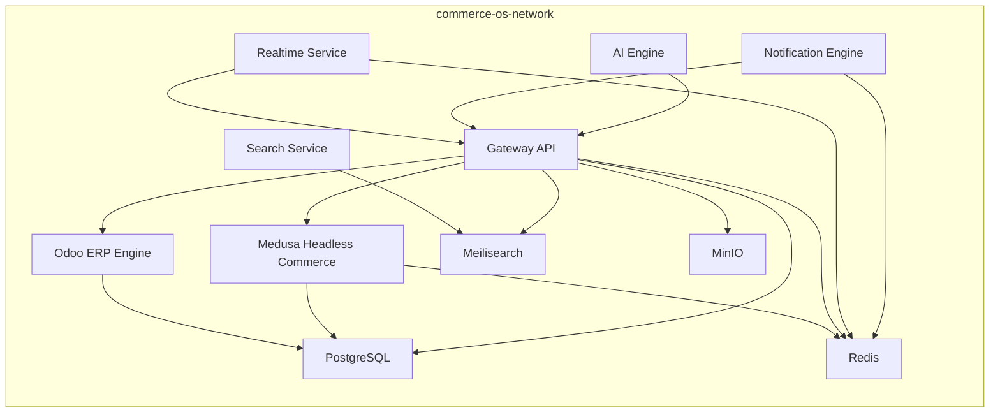

# Service Topology

Service discovery uses Docker DNS names, not host ports:

- `postgres:5432`
- `redis:6379`
- `minio:9000`
- `meilisearch:7700`
- `odoo:8069`
- `medusa:9000`
- `gateway-api:8080`
- `realtime:8091`
- `search:8092`
- `ai-engine:8093`
- `notification-engine:8094`
