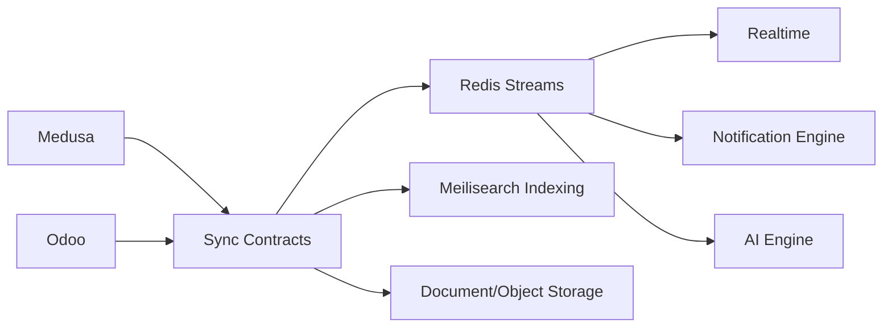

# Sync Topology

## Event Channels

- `order`
- `inventory`
- `finance`
- `sync`
- `notification`
- `ai`

All channels are tenant-scoped and replay-ready by contract.

## Checkpoints

Sync checkpoints are defined in `@commerce-os/sync-core`. Checkpoints are tenant-scoped and system-scoped. No sync workers are mounted in this phase.
